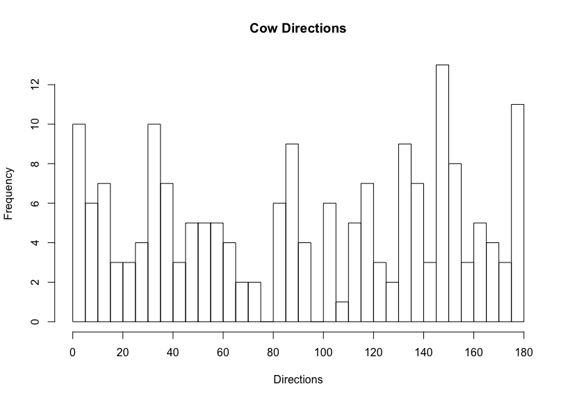

# cow-directions

For the lolz.

Analyzed the orientations of 185 cows in the image [feedlot_1.png](feedlot_1.png) using ImageJ (couldn't determine the orientations however, i.e. knew a cow pointed along North, but not if it's head pointed North or South). The directions follow the unit circle, with East at 0 degrees and West at 180 degrees.

Can't really tell anything from the data actually. Still have no idea if cows point North more often. Really want to try to make a polar histogram in R next. Also, I think they're supposed to point to magnetic North, but like they still don't seem to.

The final histogram is [final_plot.png](final_plot.png).

